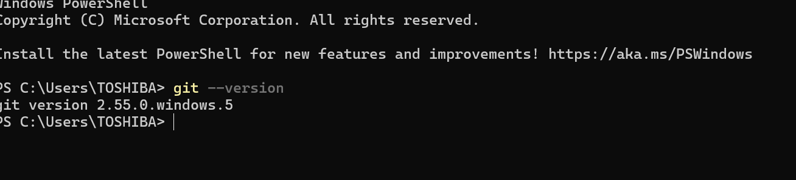
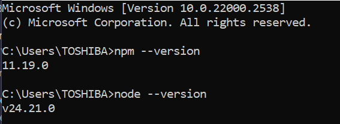
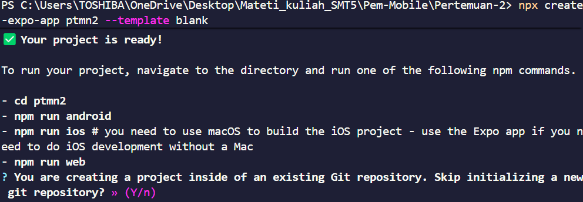
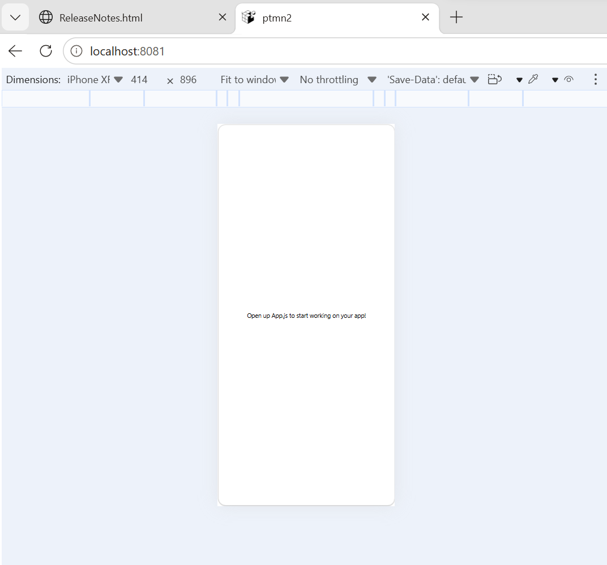
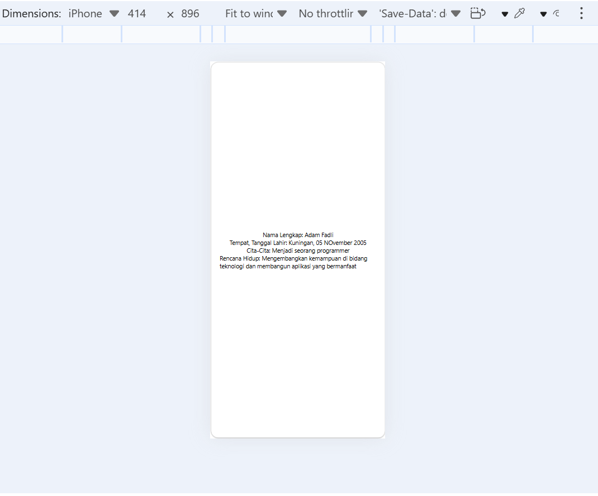

# ** Praktikum mentiapkan Pemrograman Mobile  dengan React Native **

## ** Tujuan Pembelajaran **
Setelah Menyelesaikan Modul Praktikum ini, Mahasiswa diharapkan mampu :
- Menginstal Git dan Github
- Mneginstal Node.js dan NPM
- Menginstal Expo CLI
- Membuat Project React Native

1. Instal Git di Local
    - Unduh dan Instal Git via https://git-scm.com/install/windows
    - Verifikasi Git ( Buka cmd dan ketik " git --version")
    

2. Instal node.js
    - unduh dan instal Node JS via https://nodejs.org/en/download
    - Verifikasi Node JS (buka cmd danketik " node --version" "npm --version)
    

3. Memulai Projek dengan Framework Expo
    - Buka terminal pada code editor
    - pastikan aktif di directory yang dituju
    - Ketikan (npx create-expo-app ptmn2 --template blank)
    - tunggu hingga proses instal selesai
    - projek selesai
    

4. Menjalankan Projek React Native
    - Masuk ke Directory projek(cd ptmn2)
    - jalankan projek (npx expo start)
    - scan QR code dengan Aplikasi Expo Go
    - Jika ingin run di emulator web ketik w
    - di terminal "npx expoinstall react-dom react-native-web"
    - npx expo start --web
    

5. Latihan Pertemuan 2
    - Tambahkan Beberapa text
    - Nama Lengkap
    - Tempat Tanggal Lahir
    - Cita-cita
    - Rencana Hidup
    
