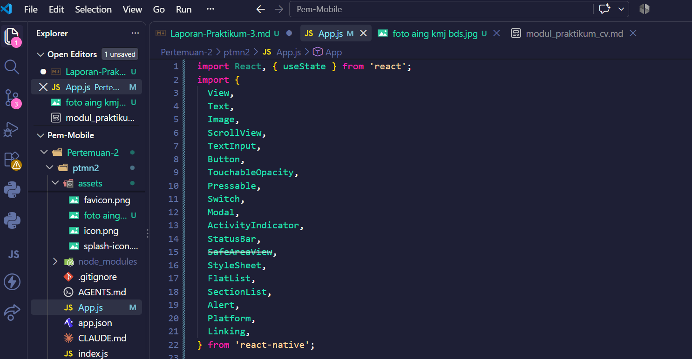
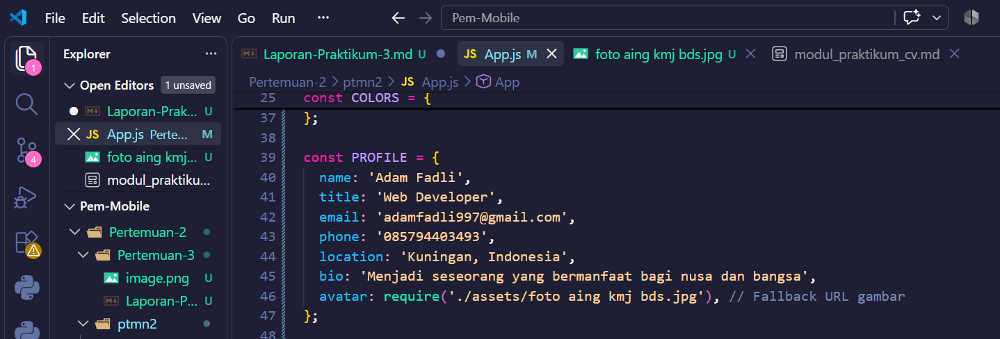
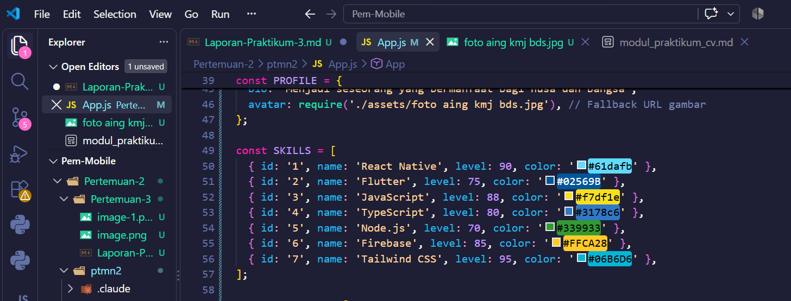
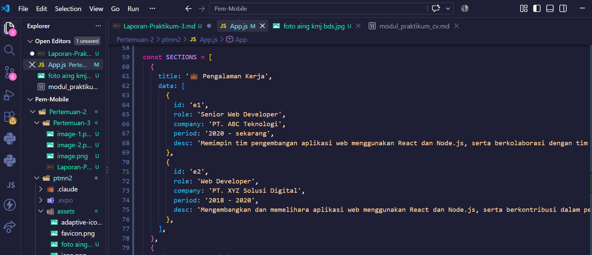
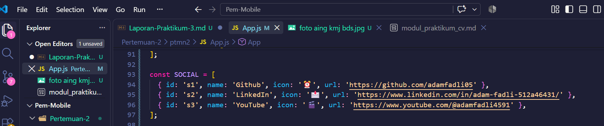

### Pengenalan Core Componen dan STyling ###

## 🎯 Tujuan Pembelajaran

Setelah menyelesaikan praktikum ini, mahasiswa mampu:

1. Memahami dan menggunakan **16 Core Components** React Native
2. Menerapkan **StyleSheet** untuk styling terpusat
3. Menggunakan **useState** untuk state management dasar
4. Membuat layout yang responsif dengan **Flexbox**
5. Menangani **interaksi pengguna** (tekan, input, scroll)

Langkah 1 : mengimpor component

1. Buka File App.js pada folder ptmn2
2. Import 16 core components sebagai berikut :
3. Konfirmasi Bukti :

Langlah 2: Menyiapkan data Objek 
Membuat objek untuk menyimpan data profil
buat objek bernama PROFIL
konfirmasi bukti:

4. Membuat Objek Array SKILSS untuk menyimpan data SKills 
5.Buat Objek Array bernama SKILSS
Bukti:

6. Membuat Objek Array SECTIONS untuk menyimpan Riwayat Pekerjaan :

7. Membuat Objek Array SOCIAL untuk menyimpan Media Sosial
8. Bukti Bagian:

9. Konfirasi bukti sosial :

App Gif :
