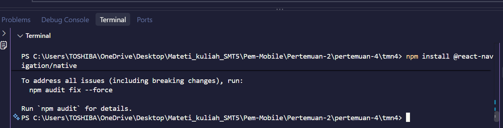
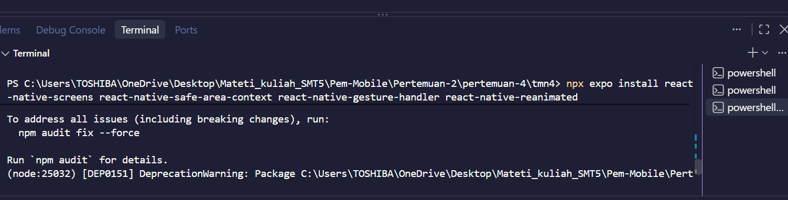
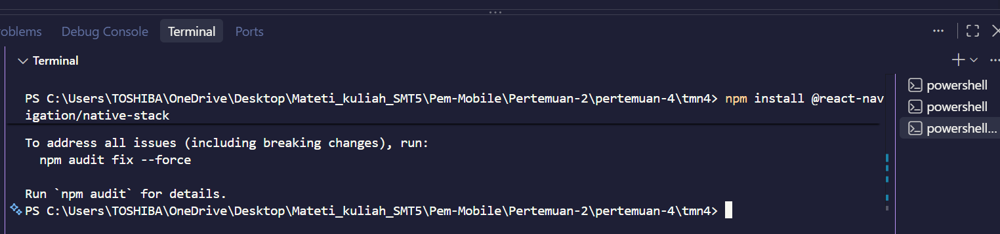
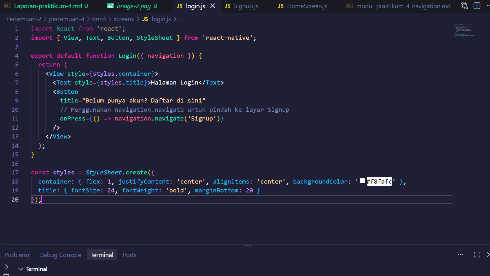
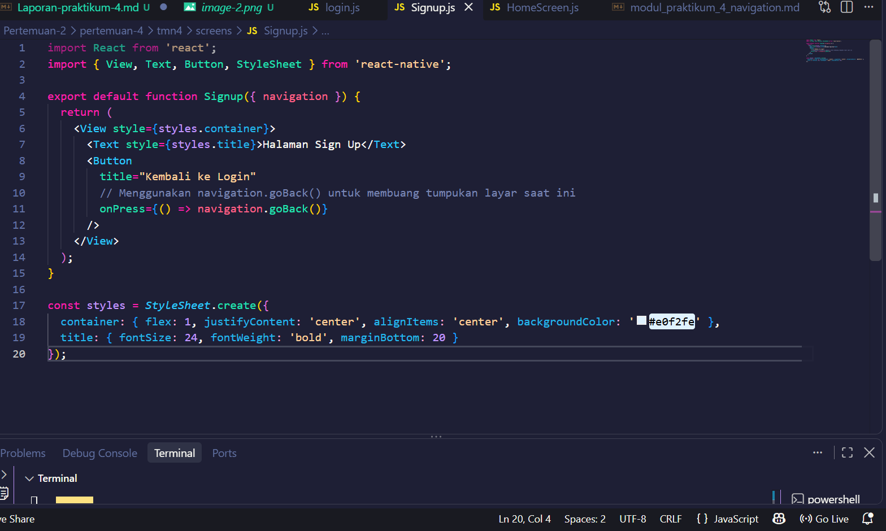
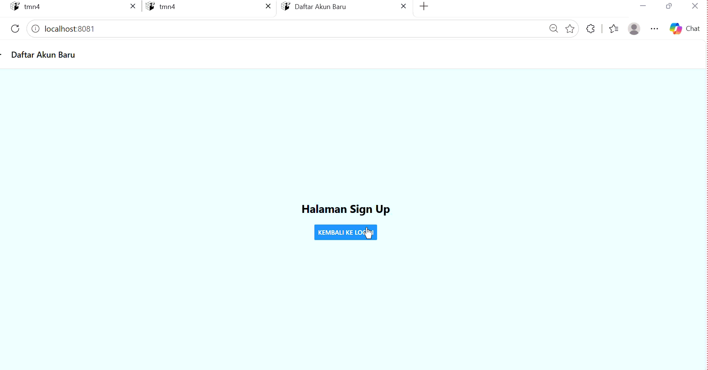
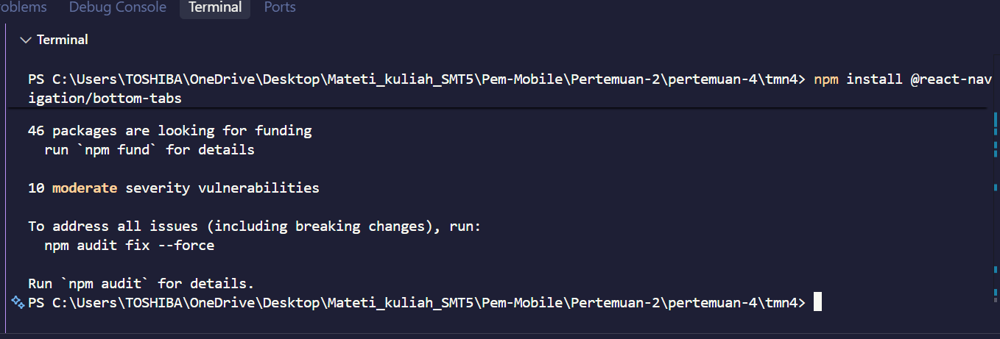
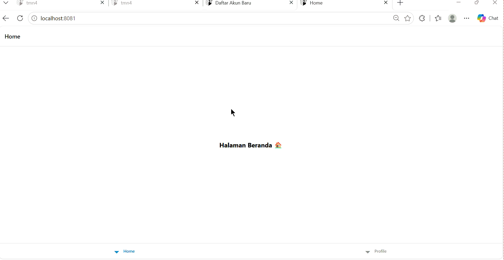
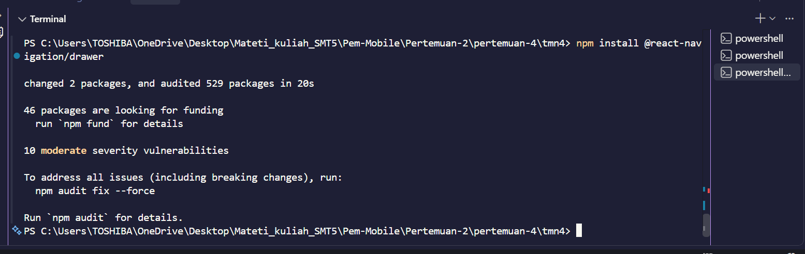
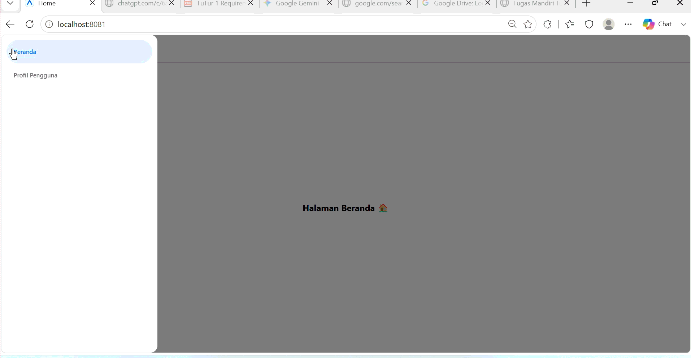

PRAKTIKUM 4: Navigasi di React Native
Tujuan Pembelajaran
Setelah menyelesaikan praktikum ini, mahasiswa diharapkan mampu:

Memahami konsep dan perpindahan layar ( routing ) pada aplikasi mobile .

1. Melakukan instalasi dan konfigurasi perpustakaan React Navigation.

2. Mengimplementasikan Stack Navigation untuk alur layar linier.

3. Mengimplementasikan Navigasi Tab untuk menu pendek bawah.

4. Mengimplementasikan Drawer Navigation untuk panel menu di samping.

5. Instal pustaka navigasi inti.

7. Instal dependensi pendukung

PRAKTIKUM 1: Navigasi Tumpukan
Langkah 1 : Instalasi Pustaka Stack

Langkah 2: file Login.js

file Signup.js

Langkah 3 : Uji coba klik tombol untuk maju dan mundur antar layar

PRAKTIKUM 3: Navigasi Laci
Langkah 1 : Instalasi Laci Pustaka

Langkah 2 :Konfigurasi laci di App.js\

PRAKTIKUM 3: Navigasi Laci

Langkah 2: Konfigurasi Drawer di `App.js`
